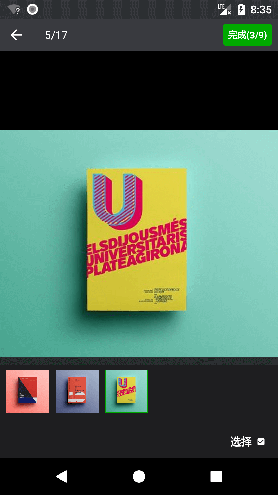

### 编者语    

EasyPhotos将在高颜值、高兼容、高性能、强功能的道路上持续更新，欢迎各种Issues，我将及时反馈，谢谢！

### 更新日志    

**1.0.4：**    
- 直接启动相机  
- 相册单选  
- 相册多选  
- 相册中支持添加自定义广告  
- 图片预览（缩放/全屏）
- UI可定制  
- 根据图片宽高进行过滤 
- 修复无图片显示时的异常    
- 内部处理权限问题，无需配置，无需处理运行时权限
    
    
    

   
# EasyPhotos
EasyPhotos会帮助你快速实现android的拍照、相册与文件夹中图片选择（单选/多选）、相册选择界面的广告View填充，展示图片宽高限制、图片预览（含缩放）、自定义UI等功能，而无需考虑运行时权限、无图片显示、工具库与应用UI不统一等问题。  

| 无选中状态   | 相册单选  | 相册多选 |
|:-----------:|:--------:|:---------:|
| |  | |  

| 相册带相机 | 相册带相机带广告 | 专辑列表|
|:-------:|:---------:|:---------:|
| |  | |  

| 专辑列表带广告   |  预览页 | 预览页单击图片转全屏模式 | 
|:-------:|:---------:|:---------:|
| |  | |   

|预览页缩放图片 | 预览页单击缩放图片显示操作栏| 持续更新 |
|:-------:|:---------:|:---------:|
| |  | |    
  
    
## 关于EasyPhotos的SDK版本   
compileSdkVersion 26  
minSdkVersion 15  
targetSdkVersion 26

## 获取EasyPhotos（通过Gradle方式）
首先，在项目的 `build.gradle（project）` 文件里面添加:

```gradle
allprojects {
	repositories {
        maven { url "https://jitpack.io" }
    }
}
```

最后，在你需要用到EasyPhotos的module中的 `build.gradle（module）` 文件里面添加：
```gradle
dependencies {
    //这个是EasyPhotos
    compile 'com.github.HuanTanSheng:easyPhotos:最新版本号'
    //以下是Glide
    compile 'com.github.bumptech.glide:glide:4.2.0'
    annotationProcessor 'com.github.bumptech.glide:compiler:4.2.0'
    //以下是PhotoView
    compile 'com.github.chrisbanes:PhotoView:2.1.3'
}
```    
[查看 EasyPhotos 的最新版本号](https://github.com/HuanTanSheng/EasyPhotos/releases) .    
[查看 EasyPhotos 的最新版本号](https://github.com/HuanTanSheng/EasyPhotos/releases) .    
[查看 EasyPhotos 的最新版本号](https://github.com/HuanTanSheng/EasyPhotos/releases) .    


为什么要添加Glide和PhotoView的引用呢？  
答：EasyPhotos使用了两个开源库的功能，他们是[Glide 4.x](https://github.com/bumptech/glide)和[PhotoView](https://github.com/chrisbanes/PhotoView)。    
因为他们足够热门，所以为了避免给你造成重复引用的可能，EasyPhotos中对他们进行了provided方式（只编译不打包场景的命令）的引用，所以你在实际项目中需要对他进行依赖。  
    
      
- 如果在引用的时候发生如下错误：  
Error:Failed to resolve: annotationProcessor
Error:Failed to resolve: com.android.support:support-annotations:26.0.2
  
这个应该是引用Glide时发生的，你需要在`build.gradle（module）` 文件里面添加：  
```gradle  

configurations.all {
    resolutionStrategy.force 'com.android.support:support-annotations:23.1.1'
}  

```    
    
如果不知道在文件的什么地方添加可以看我的示例中是如何添加的
  
## 混淆    
  
**EasyPhotos的混淆：**  
```pro  

-keep class com.huantansheng.easyphotos.constant.** { *; }  
-keep class com.huantansheng.easyphotos.models.** { *; }

```
**[Glide 4.x](https://github.com/bumptech/glide)的混淆：**   
```pro  

-keep public class * implements com.bumptech.glide.module.GlideModule
-keep public enum com.bumptech.glide.load.resource.bitmap.ImageHeaderParser$** {
  **[] $VALUES;
  public *;
}

```

**[PhotoView](https://github.com/chrisbanes/PhotoView)的混淆：** 不需要任何处理


## 你需要知道的一些事情
#### 关于权限
------
你不需要进行任何权限配置，也不用考虑运行时权限的问题，EasyPhotos内部都已经处理好了，但是我还是要告诉你EasyPhotos都用了哪些权限，她们是:
- `android.permission.CAMERA`
- `android.permission.READ_EXTERNAL_STORAGE`
- `android.permission.WRITE_EXTERNAL_STORAGE`


#### 启动EasyPhotos
------
单独使用相机  
```java
EasyPhotos.with(this, EasyPhotos.StartupType.CAMERA)
          .setFileProviderAuthoritiesText("com.huantansheng.easyphotos.sample.fileprovider")
          .start(requestCode_easyPhotos);  
```
相册单选，无相机功能
```java
EasyPhotos.with(this, EasyPhotos.StartupType.ALBUM)
          .start(requestCode_easyPhotos);
```
相册多选，无相机功能  
```java
EasyPhotos.with(this, EasyPhotos.StartupType.ALBUM)
          .setCount(9)
          .start(requestCode_easyPhotos);
```
相册单选，有相机功能  
```java  
EasyPhotos.with(this, EasyPhotos.StartupType.ALBUM_CAMERA)
          .setFileProviderAuthoritiesText("com.huantansheng.easyphotos.sample.fileprovider")
          .start(requestCode_easyPhotos);
```
相册多选，有相机功能  
```java  
EasyPhotos.with(this, EasyPhotos.StartupType.ALBUM_CAMERA)
          .setFileProviderAuthoritiesText("com.huantansheng.easyphotos.sample.fileprovider")
          .setCount(22)
          .start(requestCode_easyPhotos);
```
相册中包含广告(如果使用该模式，建议下载示例代码查看MainActivity中的具体实现）
```java  
EasyPhotos.with(this, EasyPhotos.StartupType.ALBUM_CAMERA)
          .setFileProviderAuthoritiesText("com.huantansheng.easyphotos.sample.fileprovider")
          .setCount(9)
          .setAdView(photosAdView, photosAdIsLoaded, albumItemsAdView, albumItemsAdIsLoaded)
          .start(requestCode_easyPhotos);
```
相册中包含默认勾选图片  
```java  
EasyPhotos.with(this, EasyPhotos.StartupType.ALBUM_CAMERA)
          .setFileProviderAuthoritiesText("com.huantansheng.easyphotos.sample.fileprovider")
          .setCount(9)
          .setSelectedPhotos(images)
          .start(requestCode_easyPhotos);
```
                
只显示限制尺寸以上的图片  
```java 
EasyPhotos.with(this, EasyPhotos.StartupType.ALBUM_CAMERA)
          .setFileProviderAuthoritiesText("com.huantansheng.easyphotos.sample.fileprovider")
          .setCount(9)
           .setMinSize(500, 500)
           .start(requestCode_easyPhotos);
```
   
   
#### 回调，获取选中图片路径地址集合
------
在 `onActivityResult()` 方法中获取EasyPhotos的回调图片集合:  
 - data.getStringArrayListExtra(EasyPhotos.RESULT)
  
  
```java  

List<String> mSelected = new ArrayList<>();

@Override
protected void onActivityResult(int requestCode, int resultCode, Intent data) {
    super.onActivityResult(requestCode, resultCode, data);
    if (requestCode == requestCode_easyPhotos && resultCode == RESULT_OK) {
        mSelected.clear();
        mSelected.addAll(data.getStringArrayListExtra(EasyPhotos.RESULT));
    }
}  

```    

  
#### 关于EasyPhotos的横竖屏  
EasyPhotos默认强制竖屏，如果你需要强制横屏或允许用户横竖屏切换，请按照你的需求在`manifests`文件里添加:  
```java  

         <activity
         android:name="com.huantansheng.easyphotos.ui.EasyPhotosActivity"
         android:screenOrientation="你需要的方式"
         tools:replace="android:screenOrientation"/>

        <activity
            android:name="com.huantansheng.easyphotos.ui.PreviewEasyPhotosActivity"
            android:screenOrientation="你需要的方式"
            tools:replace="android:screenOrientation"/>    
            
```
  
#### 自定义样式  

如果EasyPhotos的默认样式与你的app风格不符，可以在你的app的`colors`文件里进行修改  

```java  

    <!--顶部栏-->
    <color name="tool_bar_easy_photos">#393a3f</color>//顶部栏的背景颜色303135
    <color name="tool_bar_bottom_line_easy_photos">#303135</color>//顶部栏的底端线颜色，主要用于Z轴的视觉效果
    <color name="back_line_easy_photos">#303135</color>//顶部栏返回按钮右侧的分割线颜色
    <!--底部栏-->
    <color name="bottom_bar_easy_photos">#393a3f</color>//底部栏的背景颜色
    <!--顶部栏和底部栏文字-->    <!--返回按钮-->
    <color name="text_easy_photos">#FFFFFF</color>//文字颜色——默认，返回图标也是该颜色
    <color name="text_unable_easy_photos">#9b9b9b</color>//文字颜色——不可用状态
    <!--完成按钮-->
    <color name="menu_easy_photos">#00AA00</color>//完成按钮的背景色——可用状态
    <color name="menu_unable_easy_photos">#277327</color>//完成按钮的背景色——不可用状态
    <color name="menu_easy_stroke_photos">#6800aa00</color>//完成按钮的边框颜色，主要用于Z轴的视觉效果
    <!--相机-->
    <color name="camera_easy_photos">#00AA00</color>//相册界面相机图标的颜色  
    <!--photo选择器-->
    <color name="selector_stroke_easy_photos">#FFFFFF</color>//图片选择器的边框颜色
    <color name="selector_selected_color_easy_photos">#00AA00</color>//图片选择器选中状态的填充颜色
    <color name="selector_unable_easy_photos">#9b9b9b</color>//图片选择器不可用状态颜色
    <!--专辑项目列表-->
    <color name="album_items_background_easy_photos">#FFFFFF</color>//专辑项目列表的背景颜色
    <color name="album_items_line_easy_photos">#dee6e6e6</color>//专辑项目的分割线颜色
    <color name="album_item_choose_icon_easy_photos">#00AA00</color>//专辑项目选中状态icon的颜色
    <color name="album_item_name_easy_photos">#d0000000</color>//专辑项目列表中专辑名称的字体颜色
    <color name="album_item_count_easy_photos">#ababab</color>//专辑项目列表中包含图片张书的字体颜色
    <!--图片列表-->
    <color name="photos_line_easy_photos">#000000</color>//图片列表的分割线颜色
    <!--加载图片错误icon-->
    <color name="photo_error_easy_photos">#ff0000</color>//图片发生错误时显示icon的颜色    
    
```
    
  
#### 多语言  

EasyPhotos默认中文简体，并且没有做多语言。如果你和我一样是一名多语言程序开发者，那么你可以在我的示例程序中找到简体/繁体/英文/西班牙语/日语/韩语的string文件（英文在默认文件夹内），如果还不能满足你，可以在你的多语言`string`文件中添加：    

```java    

    <string name="selector_folder_all_easy_photos">所有图片</string>  
    
    <string name="selector_easy_photos">选择</string>
    
    <string name="selector_action_done_easy_photos">完成(%1$d/%2$d)</string>
    
    <string name="selector_preview_easy_photos">预览</string>

    <string name="selector_reach_max_image_hint_easy_photos">最多只能选择%d张图片</string>
    
    <string name="msg_no_camera_easy_photos">无法启动相机！</string>
    
    <string name="camera_temp_file_error_easy_photos">图片错误</string>

    <string name="selector_permission_error_easy_photos">权限错误，无法正常工作！</string>

    <string name="selector_image_size_error_easy_photos">图片的宽度必须大于%1$d,高度必须大于%2$d</string>

    <string name="selector_image_type_error_easy_photos">不支持此图片格式</string>

    <string name="edit_easy_photos">编辑</string>

    <string name="empty_easy_photos">清空</string>

    <string name="no_photos">没有符合要求的图片，拍一张吧</string>

    <string name="permissions_again">请允许相关权限</string>
    
    <string name="permissions_die">请在设置中允许相关权限</string>    
    
``` 
- 示例中的主页并没有做多语言，所以无论你如何切换语言她都将是中文简体，但是跳转EasyPhotos的相册后将会呈现多语言


## 感谢 
[Glide](https://github.com/bumptech/glide)：我心目中最好的图像加载和缓存库，由[Bump Technologies](https://github.com/bumptech) 团队编写    

[PhotoView](https://github.com/chrisbanes/PhotoView)：一个强大的图片缩放库，由[chrisbanes](https://github.com/chrisbanes) 大神编写    

